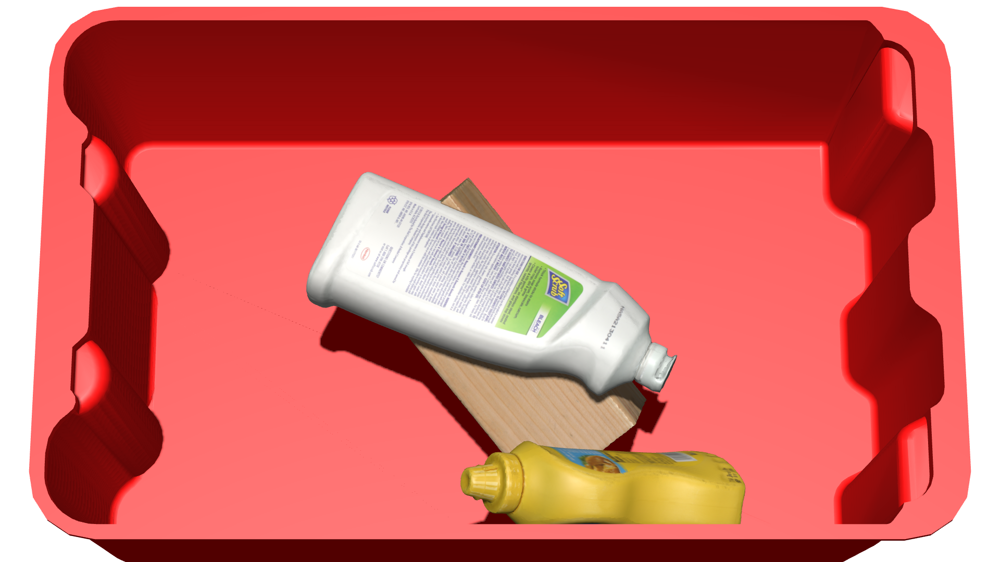
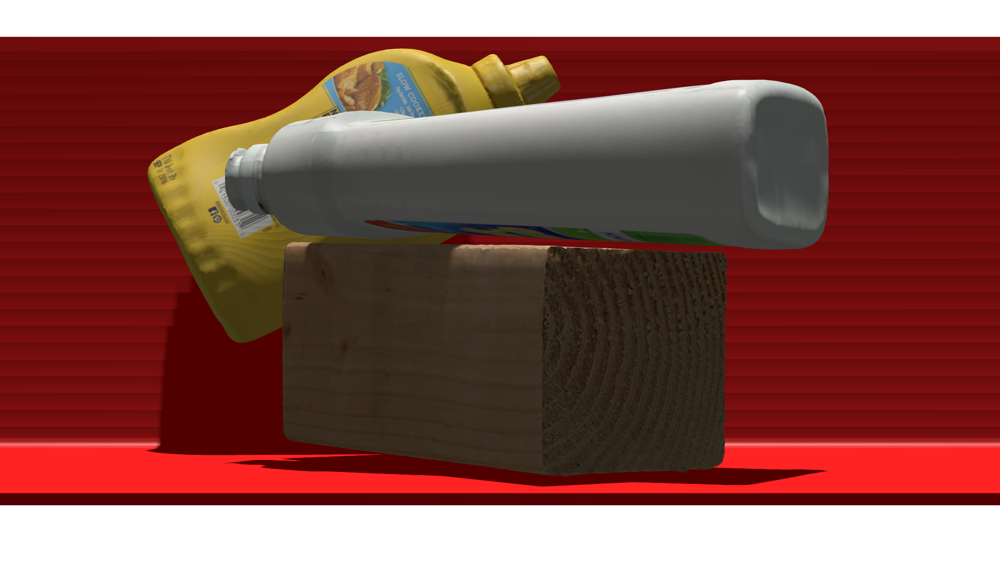
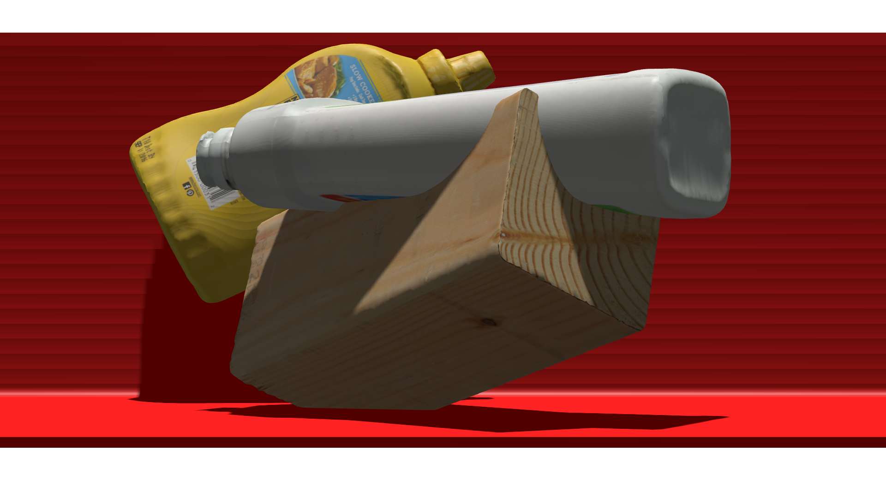
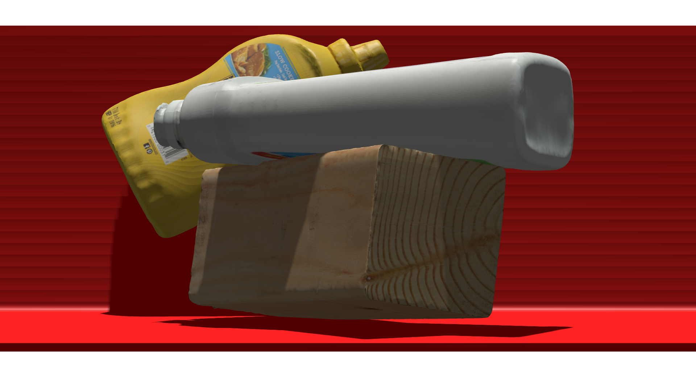

# Physically Plausible Object Pose Refinement in Cluttered Scenes
 
This repository contains the source code for our paper:

Michael Strecke and Joerg Stueckler<br/>
Physically Plausible Object Pose Refinement in Cluttered Scenes<br/>
Accepted for the German Conference on Pattern Recognition (GCPR) 2024

If you use the code provided in this repository for your research, please cite our paper as:
```
@inproceedings{strecke2024_physically,
  title = {Physically Plausible Object Pose Refinement in Cluttered Scenes},
  author = {Strecke, Michael and Stueckler, Joerg},
  booktitle = {Proc. of German Conference on Pattern Recognition (GCPR)},
  note = {to appear},
  year = {2024}
}
```

|            Input/GT             |                   CIR                   |                   Ours                    |
|:-------------------------------:|:---------------------------------------:|:-----------------------------------------:|
|       |      |      |
|  |  |  |

## Getting Started
1. Clone the repo using the `--recursive` flag 
   ```
   git clone --recursive https://github.com/EmbodiedVision/cir-phys
   cd cir-phys
   ```

2. Set up/install CUDA version 12.1 (which is the version used to build the PyTorch version specified in [environment.yaml](environment.yaml)).

3. Create a new anaconda environment using the provided .yaml file (requires an NVidia GPU)
   ```
   export PIP_NO_BUILD_ISOLATION=0
   conda env create -f environment.yaml
   conda activate cir_phys
   ```
   Setting the `PIP_NO_BUILD_ISOLATION` environment variable is needed as otherwise pip will use the most recent PyTorch version when building [ev-sdf-utils](https://github.com/EmbodiedVision/ev-sdf-utils), leading to a potentially incompatible build with the installed version.

## Download model checkpoints
Download pretrained model weights provided by the authors of Coupled Iterative Refinement (2.4Gb) by running
```
chmod ug+x download_model_weights.sh &&  ./download_model_weights.sh
```
or downloaded from [the CIR repository](https://github.com/princeton-vl/Coupled-Iterative-Refinement)

To demo a trained model on the example that generated Fig 1 in the paper
```
python demo_batch.py --obj_models synpick --scene_dir sample_synpick --load_weights model_weights/refiner/ycbv_rgbd.pth
```
The demo saves images of the pose refinement to `qualitative_output/`, which can be flipped through using any image viewer.
Add the `--intersection` flag to compare results with the ones obtained by using our intersection constraint (specify a different output directory by `--output_dir`).

## Full Datasets (for evaluation)
To evaluate our method, you will need to download at least one of the following datasets in the BOP format:
- [YCB-V (YCB-Video)](https://bop.felk.cvut.cz/datasets/#:~:text=20%20test%20images-,YCB%2DV%20(YCB%2DVideo),-Xiang%20et%20al)
- [SynPick (not part of original BOP benchmark suite)](https://www.ais.uni-bonn.de/datasets/synpick/)

To download and unzip any of the core BOP datasets (LM-O, T-LESS, YCB-V, IC-BIN), we provide a script:
```
python additional_scripts/download_datasets.py --bop_dataset ycbv --models ycbv
```
To download the Pascal VOC dataset used for background data-augmentation, run
```
python additional_scripts/download_datasets.py --augmentation_textures # Downloads VOC2012
```

The SynPick dataset should be downloaded from the link provided above and placed in the `local_data` subfolder as indicated below.
You will further need to copy/link the target files from [synpick_targets](synpick_targets) to `local_data/bop_datasets/synpick`.
As SynPick does not contain the object models, we linked the `models` folder from `ycbv` into the synpick directory.

By default `bop.py` will search for the datasets in these locations.

```Shell
├── local_data
    ├── VOCdevkit
        ├── VOC2012
    ├── bop_datasets
        ├── ycbv
        ├── synpick
```

## Generate volumetric SDF models for the meshes in the dataset
The volumetric SDF models can be generated by executing
```bash
python convert_mesh_to_sdf.py --input local_data/bop_datasets/ycbv/models/obj_000001.ply --output local_data/bop_datasets/ycbv/models/obj_000001.npz --resolution 64
```
for all objects in the dataset.

For the tote on Synpick, call the above script with the `tote.glb` models from the [Synpick repository](https://github.com/AIS-Bonn/synpick), also placing the result in the `models` folder in ycbv.

For generating a background plane for YCB video, run `python gen_plane_sdf.py` and place the resulting `plane.npz` in `local_data/bop_datasets/ycbv/models`.

To use the plane as additional background cue, you will further need to download the prepared samples from the [SporeAgent repository](https://github.com/dornik/sporeagent) and place them in `local_data/bop_datasets/ycbv/sporeagent`.

## Evaluation

To run our end-to-end pipeline to reproduce our results, run
```
python test_batch.py --save_dir my_evaluation --dataset synpick-pick-targeted --load_weights model_weights/refiner/ycbv_rgbd.pth --intersection
```
This will deposit a .tar file in `my_evaluation/`. The evaluation is slow, but can be run in parallel for different portions of the test set using `--start_index` and `--num_images`, with each run depositing a separate .tar file in `my_evaluation/`. If using a slurm array job to distribute testing, these arguments will be automatically set.

See `python test_batch.py -h` for a list of allowed values to `--dataset`. Note that for the SynPick dataset, the string should include the split (`synpick-pick-targeted` or `synpick-pick-untargeted`), while for the core BOP datasets, the dataset name is sufficient.

The flag `--intersection` enables the intersection constraint introduced in our paper.
Further flags used in our experiments include `--use_gt_masks` for using GT segmentation masks instead of the Mask R-CNN detector,
`--max_detections` to limit the number of detections (in case of memory issues if too many objects are present),
`--no_tote` to ignore the background box for SynPick, and `--low_res_grid_factor` to use fewer point in the query grid.
Documentation on all arguments to `test_batch.py` can be retrieved by running `python test_batch.py -h`.
Note that for the SynPick dataset, the `ycbv_rgbd.pth` refiner model weights should be used. For the core BOP datasets,
use the respective provided model weights.

To evaluate the predictions, first set up the [BOP Toolkit repository](https://github.com/thodan/bop_toolkit), by cloning the repo, checking out commit `37d79c4c5fb027da92bc40f36b82ea9b7b197f1d`, applying our custom patch to it:
```bash
git clone https://github.com/thodan/bop_toolkit.git
cd bop_toolkit
git checkout 37d79c4c5fb027da92bc40f36b82ea9b7b197f1d
git apply /path/to/CIR-Phys/additional_scripts/bop_toolkit.patch
pip install -e .
```
For evaluating penetrations, generate SDF models at a resolution of 128 in each dimension by running the script above with the flag `--resolution 128` and placing the results in `local_data/bop_datasets/ycbv/models_sdf_128`.
Also generate the high-resolution SDF for the tote and the plane and place them in that folder (for the plane, you will have to adjust the resolution in [gen_plane_sdf.py](gen_plane_sdf.py).

Then, set the environment variable `BOP_TOOLKIT_PATH` to the location of `bop_toolkit` and run: 
```
python additional_scripts/run_gcpr24_eval.py --dataset synpick --tar_dir my_evaluation --result_id results-intersection --split test_pick_targeted --csv_dir /path/to/predictions_csv --eval_dir /path/to/eval_results --eval_bg_pen
```
The `--split` argument is only necessary for the SynPick dataset and should match the dataset chosen above in `test_batch.py`.
For the core BOP datasets, the default `test` split will be used.
The `--result_id` should be some string which can well identify the experiment (e.g. contain whether the intersection constraint was used).
The flag `--eval_bg_pen` tells the script to consider penetrations with the background for evaluation on Synpick and YCB Video.
It cannot include underscores ("`_`").

This script will then compute the penetration evaluation scores and the AD recall scores.
For the ADD/ADI/AD AUC performance scores on YCB Video, the resulting CSV files should be processed according to the pipeline described in [SporeAgent](https://github.com/dornik/sporeagent).

## (Optional) Faster Implementation
To use the faster CUDA implementation of the correlation sampler as proposed by the authors of Coupled Iterative refinement, compile the module by running:
```
cd cir/pose_models/modules && pip install . && cd - # Compiles corr_sampler
```

## Acknowledgement

This repository makes extensive use of code from the [Coupled Iterative Refinement](https://github.com/princeton-vl/Coupled-Iterative-Refinement) GitHub repository. We thank the authors for open sourcing their implementation.

This work was supported by the Max Planck Amazon Science Hub.

## License
This code is licensed under the [MIT License](LICENSE), see [NOTICE](NOTICE) for attribution notices of the code from [Coupled Iterative Refinement](https://github.com/princeton-vl/Coupled-Iterative-Refinement).
